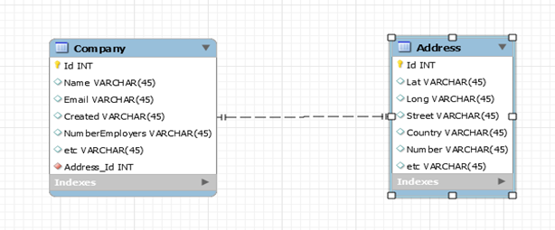
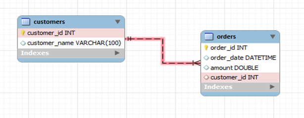

## RELACIONES

La *primary key* para identificar de forma única cada fila de la tabla.
- Es una columna (o varias) que identifica de forma única cada fila de la tabla.
- No se puede repetir.
- No puede estar en blanco (no puede ser NULL).

Una *foreign key* referencia a la clave principal en otra tabla.
- Es una columna en una tabla que apunta a la primary key de otra tabla.
- Sirve para relacionar tablas.
- Garantiza que lo que contiene existe en la otra tabla.

### TIPOS RELACIONES 

1 PUBLICACION PERTENECE A 1 USUARIO --> 1:N
1 PUBLICACION PERTENECE A VARIOS USUARIOS --> M:N
1 PERSONA TIENE 1 DNI UNICO, NADIE LO PUEDE TENER SI ES TUYO --> 1:1

En SQL, hay tres tipos de relaciones: **uno a uno (1: 1), uno a muchos (1: N) o muchos a muchos (M: N)** que se pueden modelar.

Uno a uno. El dato de una tabla se relacionan con solo un dato de otra tabla
Uno a muchos. El dato de una tabla se relaciona con muchos datos de otra tabla
Muchos a muchos. Muchos datos de una tabla se relacionan con muchos datos de otra

1. Uno a uno. La foreign Key se pondrá en la tabla que podría ser el muchos. Por ejemplo un estudiante solo puede tener un carnet de universidad. Y un carnet solo puede pertenecer a un estudiante. La relación es uno a uno. ¿Donde pondrias la foreign Key? En los carnets, ya que, pueden caducar, por lo tanto un estudiante puede llegar a tener otro carnet nuevo.

2. Uno a muchos. Imaginemos una red social, un usuario puede tener muchas publicaciones, pero una publicación solo puede ser de un usuario. En este caso el “muchos” es publicaciones y por ello la foreign key iría en la tabla de publicaciones.

3. Muchos a muchos. Cuando tenemos una relación muchos a muchos, como por ejemplo pedidos y productos. Se crearía una tabla intermedia y en esa tabla se guardarían las foreign keys.

## Creamos nuestro primer diagrama con dbdiagram

## INNERJOIN

- INNER JOIN selecciona todas las filas de ambas tablas participantes siempre que haya una coincidencia entre las columnas.
- INNER JOIN une dos tablas de acuerdo con la coincidencia de ciertos criterios utilizando un operador de comparación.

